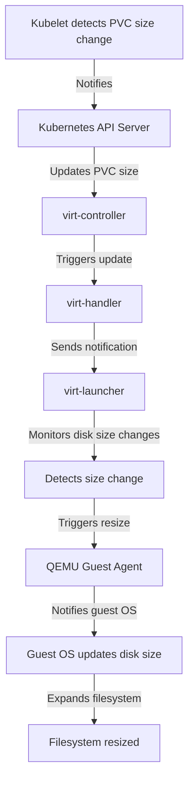

# PR Link

This document is associated with [PR #5981](https://github.com/kubevirt/kubevirt/pull/5981) in the KubeVirt repository.

# PR #5981: Online Resize Support for Hotplugged Disks in virt-launcher

## Overview
This document explains the implementation of online resize support for hotplugged disks in the `virt-launcher` component of KubeVirt. The feature allows virtual machines to dynamically expand hotplugged disks without requiring a VM restart.

---

## Key Changes in `virt-launcher`

1. **Monitoring Disk Size Changes**:
   - The `virt-launcher` process is updated to monitor size changes for hotplugged disks. This is achieved by periodically checking the size of the underlying Persistent Volume Claims (PVCs) associated with the hotplugged disks.

2. **Resizing Hotplugged Disks**:
   - When a size change is detected for a hotplugged disk, the `virt-launcher` triggers a resize operation. This involves notifying the guest operating system about the new disk size using the QEMU Guest Agent or other mechanisms supported by QEMU.

3. **Filesystem Expansion**:
   - For hotplugged disks backed by Filesystem PVCs, the implementation ensures that the filesystem inside the guest is expanded to utilize the additional space. This is done by invoking the appropriate commands within the guest OS, such as `resize2fs` for ext-based filesystems.

4. **Integration with Feature Gate**:
   - The online resize functionality for hotplugged disks is gated behind the `ExpandDisks` feature gate. This ensures that the feature is only active when explicitly enabled by the user.

5. **Error Handling and Logging**:
   - The implementation includes robust error handling to manage scenarios where resizing fails (e.g., due to unsupported storage classes or guest OS limitations). Detailed logs are added to help users debug issues.

---

## Workflow in `virt-launcher`

1. **Initialization**:
   - When a hotplugged disk is attached to a virtual machine, `virt-launcher` registers the disk and begins monitoring its size.

2. **Detection of Size Changes**:
   - The size of the PVC backing the hotplugged disk is periodically checked. This is done by querying the Kubernetes API or inspecting the underlying storage device.

3. **Triggering Resize**:
   - If a size change is detected, `virt-launcher` sends a resize request to QEMU. For Filesystem PVCs, it also ensures that the filesystem is expanded to match the new size.

4. **Guest Notification**:
   - The guest OS is notified of the size change using the QEMU Guest Agent, which updates the disk size visible to the guest.

---

## Workflow Diagram



---

## Detailed Workflow Steps

1. **Kubelet detects PVC size change**:
   - This step is not directly represented in the code snippets but is part of the Kubernetes infrastructure that triggers updates when a PVC size changes.

2. **Kubernetes API Server updates PVC size**:
   - Again, this is part of Kubernetes' functionality and is not directly shown in the `virt-launcher` code.

3. **virt-controller triggers update**:
   - This step involves the `virt-controller`, which is responsible for managing updates to virtual machine configurations. It is not explicitly shown in the provided code snippets.

4. **virt-handler sends notification**:
   - The `virt-handler` component notifies `virt-launcher` about the PVC size change. This is also not directly shown in the snippets but is part of the workflow leading to `virt-launcher`'s actions.

5. **virt-launcher monitors disk size changes**:
   - The monitoring of disk size changes is implied in the workflow described in the document. The `virt-launcher` periodically checks the size of the PVC backing the hotplugged disk. This is implemented in `manager.go` at line 591, where the `qemu-img resize` command is used to expand the disk image size.

6. **Detects size change**:
   - The detection of size changes is part of the monitoring process. The code snippet in `manager.go` (line 591) shows how the `qemu-img resize` command is used to expand the disk image size when a change is detected.

7. **Triggers resize**:
   - The `BlockResize` function in `manager.go` (lines 905-908) is invoked to resize the disk and notify the guest OS about the new size. This corresponds to the "Triggers resize" step in the flowchart.

8. **QEMU Guest Agent notifies guest OS**:
   - The `BlockResize` function in `libvirt.go` (line 462) interacts with the QEMU Guest Agent to notify the guest OS about the size change.

9. **Guest OS updates disk size**:
   - The guest OS updates the disk size based on the notification from the QEMU Guest Agent. This is part of the functionality triggered by the `BlockResize` method.

10. **Expands filesystem**:
    - For Filesystem PVCs, the filesystem inside the guest is expanded to utilize the additional space. This is implied in the workflow but not explicitly shown in the provided code snippets.

---

## Relevant Code Snippets

### `manager.go`

#### Line 591
The `qemu-img resize` command is used to expand the disk image size:
```go
cmd := exec.Command("/usr/bin/qemu-img", "resize", preallocateFlag, imagePath, strconv.FormatInt(size, 10))
out, err := cmd.CombinedOutput()
if err != nil {
    return fmt.Errorf("Expanding image failed with error: %v, output: %s", err, out)
}
return nil
```

#### Line 897
A comment indicates the logic for resizing and notifying the VM about changed disks:
```go
// Resize and notify the VM about changed disks
```

#### Lines 905-908
The `BlockResize` function is invoked to resize the disk and notify the guest OS about the new size:
```go
905: err := dom.BlockResize(getSourceFile(disk), uint64(possibleGuestSize), libvirt.DOMAIN_BLOCK_RESIZE_BYTES)
906: if err != nil {
907:     logger.Reason(err).Errorf("libvirt failed to expand disk image %v", disk)
908: }
```

### `libvirt.go`

#### Line 462
The `BlockResize` method is defined, which is used to resize a disk via libvirt:
```go
462: BlockResize(disk string, size uint64, flags libvirt.DomainBlockResizeFlags) error
```

### `generated_mock_libvirt.go`

#### Lines 327-334
The `BlockResize` function is mocked for testing purposes:
```go
327: func (_m *MockVirDomain) BlockResize(disk string, size uint64, flags libvirt.DomainBlockResizeFlags) error {
328:     ret := _m.ctrl.Call(_m, "BlockResize", disk, size, flags)
329:     ret0, _ := ret[0].(error)
330:     return ret0
331: }

333: func (_mr *_MockVirDomainRecorder) BlockResize(arg0, arg1, arg2 interface{}) *gomock.Call {
334:     return _mr.mock.ctrl.RecordCall(_mr.mock, "BlockResize", arg0, arg1, arg2)
335: }
```

---

## Testing and Validation

- Unit tests and integration tests are added to validate the following:
  - Detection of size changes for hotplugged disks.
  - Successful resizing of both raw block devices and Filesystem PVCs.
  - Proper handling of errors during the resize process.
  - Behavior when the `ExpandDisks` feature gate is disabled.

---

This implementation enhances KubeVirt's flexibility by allowing users to dynamically expand hotplugged disks without requiring a VM restart, improving the overall user experience for managing storage in virtualized environments.